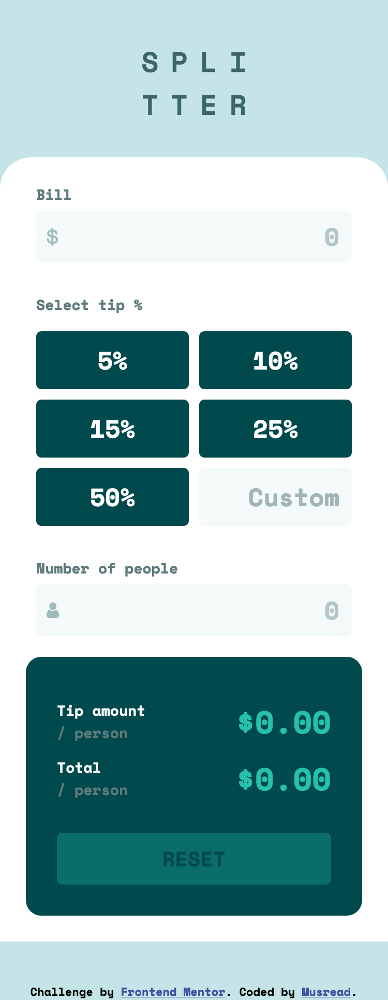

# Tip calculator

**Hi everyone 👋 !**

I confess. I completely forgot this project somewhere in my computer 😅.

Anyway, this is my solution for another [FrontendMentor](https://www.frontendmentor.io) challenge.

## Table of contents

- [Overview](#overview)
  - [The challenge](#the-challenge)
  - [Screenshots](#screenshots)
  - [Links](#links)
- [My process](#my-process)
  - [Built with](#built-with)
  - [Issues I met while building](#issues-i-met-while-building)
- [Author](#author)

## Overview

### The challenge

This time, it's a tip calculator I had to build ! The link : [Tip calcutator](https://www.frontendmentor.io/challenges/tip-calculator-app-ugJNGbJUX).

### Screenshots

This is my solution for **desktop screens**:

And this is for **mobile screens**:

### Links

- Live Site URL: https://musread.github.io/tip-calculator/

## My process

### Built with

- Semantic HTML5 markup
- CSS custom properties
- Flexbox
- Node Modules

## Issues I met while building

### Regular expressions

For analyzing what users input, I need to use a reliable functionality. I first laid on conversion functions from the **Number** class, but I quickly realized it was not perfect. This is why I choose regular expressions. I rely on the official MDN docs as usual to learn more about it. Here's the link : https://developer.mozilla.org/en-US/docs/Web/JavaScript/Guide/Regular_expression

### Number inputs vs text inputs

When I was building inputs, I quickly chose to make them "number-typed". But I bumped into a problem while I was implementing conditional logics. Indeed, when I tried to retrieve invalid values from number inputs, it gave me an empty string. This [Stackoverflow article](https://stackoverflow.blog/2022/12/26/why-the-number-input-is-the-worst-input/) helped me to choose the right solution.

### Formatting numbers

For the sake of a better user experience, I needed to choose how many units I wanted to display for output numbers. I discovered many JS features, thanks to this [article](https://medium.com/@stheodorejohn/mastering-number-formatting-in-javascript-d72acc0453df)

## Author

- GitHub - https://github.com/Musread
- Frontend Mentor - [@musread](https://www.frontendmentor.io/profile/musread)
